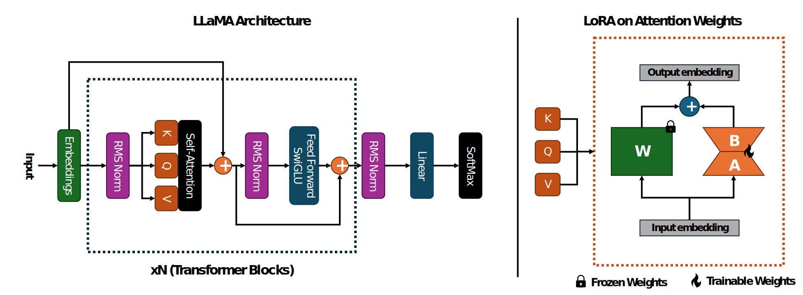

# Low-Rank Adaptation of LLMs for Commit Message Generation

**Authors:** 

Ahmet Can Bağırgan, Hasan Alp Caferoğlu, Ahmet Burak Yıldırım

---

**Abstract:**

Automated commit message generation addresses a key challenge in software engineering: the difficulty developers face in writing clear, self-explanatory, and consistent commit messages. This task is crucial for maintaining project organization, as it helps current and future developers understand code changes, efficient collaboration, and long-term project maintenance.

This study aims to improve the generation of meaningful commit messages by utilizing Large Language Models (LLMs) for the task of automated commit message generation. To achieve this, we explore the effectiveness of the Low-Rank Adaptation (LoRA) technique, investigating its ability to enhance model performance while maintaining computational efficiency.



---

### Creating Conda Environment

Set up the Conda environment by creating it using the provided environment.yml file and activating it. This ensures all necessary dependencies and tools are installed on your local machine.

```
conda env create -f environment.yml
conda activate acm-lora
```

### Dataset Extraction

This section downloads the dataset from the given URL, extracts it, and removes the compressed file to save space.

```
mkdir data
cd data
wget https://zenodo.org/records/5025758/files/filtered_data.tar.gz?download=1
tar -xvf filtered_data.tar.gz
rm filtered_data.tar.gz
```

### Dataset Preprocessing

Converts the raw dataset into csv format that is compartible for training and evaluation.

```
python dataset_csv_converter.py
```

### Trainig LoRA for an LLM Model

The train.sh script automates the fine-tuning of a quantized LLaMA model (Llama-3.2-3B-Instruct-bnb-4bit) using Low-Rank Adaptation (LoRA). It iterates over different values for the LoRA rank hyperparameter to train and evaluate their impact. The script ensures efficient training with 4-bit quantization.

```
bash train.sh
```

#### **Key Parameters**:
- **`--lrank`**: The rank of the LoRA adaptation layers, controlling the dimensionality of the adaptation.
- **`--lalpha`**: The scaling factor for LoRA layers, influencing the magnitude of updates during training.
- **`--llm_model`**: Specifies the pre-trained LLM model to fine-tune (e.g., `Llama-3.2-3B-Instruct-bnb-4bit`).
- **`--max_seq_length`**: Sets the maximum input sequence length (default: 4096 tokens).
- **`--load_in_4bit`**: Enables 4-bit quantization for efficient training with reduced memory requirements.
- **`--epoch`**: Number of training epochs (default: 1).
- **`--steps`**: Total number of training steps (default: 0, i.e., no step limit).
- **`--per_device_train_batch_size`**: Defines the training batch size per device (default: 16).
- **`--learning_rate`**: Specifies the learning rate for model optimization (default: `2e-4`).


### Taking Inference on the Trained LoRA Model

The inference.sh script evaluates the trained LoRA models by iterating over various rank values. It uses the same quantized LLaMA model (Llama-3.2-3B-Instruct-bnb-4bit) and supports sequence lengths of up to 4096 tokens.

```
bash inference.sh
```

#### **Key Parameters**:
- **`--lrank`**: The rank of the LoRA adaptation layers, controlling the dimensionality of the adaptation.
- **`--lalpha`**: The scaling factor for LoRA layers, affecting the magnitude of updates during inference.
- **`--llm_model`**: Specifies the pre-trained LLM model to use (e.g., `Llama-3.2-3B-Instruct-bnb-4bit`).
- **`--max_seq_length`**: Sets the maximum input sequence length (default: 4096 tokens).
- **`--load_in_4bit`**: Enables 4-bit quantization for efficient inference.
- **`--per_device_train_batch_size`**: Defines the batch size during inference, set to 32 for this script.
- **`--inference_batch_size`**: Processes one input sample per inference batch.
- **`--learning_rate`**: Specifies the learning rate used for updates during training (default: `2e-4`).


### Taking Inference on the Base LLM Model

The inference_base.sh script evaluates the performance of base Large Language Models (LLMs) without LoRA fine-tuning. It loops over a list of predefined quantized LLMs, such as Llama-3.2-3B-Instruct-bnb-4bit, and performs inference. This script is implemented for benchmarking the baseline capabilities of the LLMs for commit message generation.

```
bash inference_base.sh
```

#### **Key Parameters**:
- **`--llm_model`**: Specifies the base LLM model to use for inference (e.g., `Llama-3.2-3B-Instruct-bnb-4bit`).
- **`--max_seq_length`**: Sets the maximum length of the input sequence (default: 4096 tokens).
- **`--load_in_4bit`**: Enables 4-bit quantization for efficient inference with reduced memory usage.
- **`--inference_batch_size`**: Defines the number of samples processed per inference batch (default: 1).

### Evaluating the Trained or Base Model Outputs

The eval.sh script evaluates the quality of generated commit messages by comparing them to ground truth labels. It computes metrics like BLEU, ROUGE, and METEOR to assess the precision, recall, and semantic similarity of the generated messages.

```
bash eval.sh
```

#### **Key Parameters**:
- **`--label_path`**: Path to ground truth labels (e.g., `dataset/test.csv`).
- **`--result_path`**: Path to model-generated responses (e.g., `model_responses/model_response.json`).
- **`--outfile`**: File to save evaluation results (e.g., `results/results.txt`).
- **`--nrows`**: Number of rows to evaluate.
- **`--msize`**: Minimum message size for evaluation.

#### **Output**:
The results include BLEU, ROUGE, and METEOR scores, saved to the specified output file (e.g., `results/results.txt`).

### **Observing the Dataset**

This script analyzes the distribution of commit message lengths in the train and test datasets. It generates histograms for both the original and filtered datasets, saving them as images in the `dataset_distributions/` directory. It also filters datasets based on commit message length and prints basic statistics for better understanding of the dataset structure.

```
python observe_dataset.py
```

